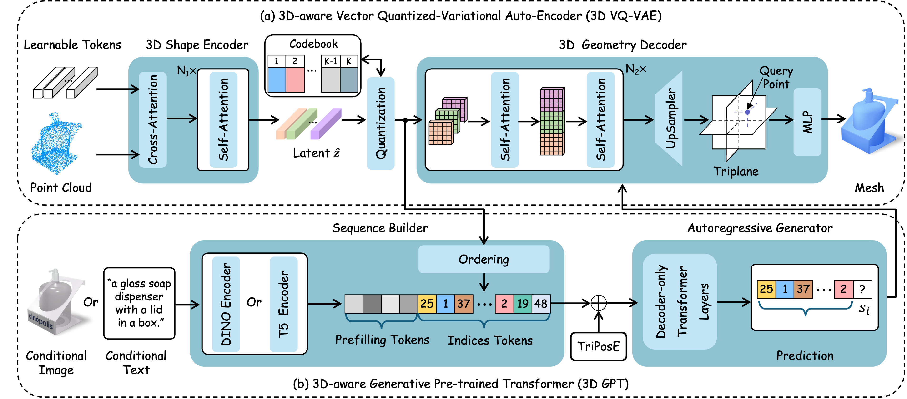

# <p align=center> :fire: `TAR3D: Creating High-Quality 3D Assets via Next-Part Prediction`</p>



<div align="center">
  
  [[Paper](https://arxiv.org/pdf/2412.16919)] &emsp; [[Project Page](https://zhangxuying1004.github.io/projects/TAR3D/)] &emsp;  [[Jittor Version]()]&emsp; [[Demo]()]   <br>

</div>

## 🚩 **Todo List**
- [ ] Source code of 3D VQVAE.
- [ ] Source code of 3D GPT.
- [ ] Pretrained weights of 3D reconstruction.
- [ ] Pretrained weights of text-to-3D generation.
- [ ] Pretrained weights of image-to-3D generation.

# 🔧 Dependencies and Installation
We recommend using `Python>=3.10`, `PyTorch>=2.1.0`, and `CUDA>=12.1`.
```bash
conda create --name tar3d python=3.10
conda activate tar3d
pip install -U pip

# Ensure Ninja is installed
conda install Ninja

# Install the correct version of CUDA
conda install cuda -c nvidia/label/cuda-12.1.0

# Install PyTorch and xformers
# You may need to install another xformers version if you use a different PyTorch version
pip install torch==2.1.0 torchvision==0.16.0 torchaudio==2.1.0 --index-url https://download.pytorch.org/whl/cu121
pip install xformers==0.0.22.post7

# For Linux users: Install Triton 
pip install triton

# Install other requirements
pip install -r requirements.txt
```


## 🤗 Acknowledgements

We thank the authors of the following projects for their excellent contributions to 3D generative AI!

- [Michelangelo](https://github.com/NeuralCarver/Michelangelo/)
- [InstantMesh](https://github.com/TencentARC/InstantMesh)
- [OpenLRM](https://github.com/3DTopia/OpenLRM)


## :books: BibTeX
If you find TAR3D useful for your research and applications, please cite using this BibTeX:

```BibTeX
@article{zhang2024tar3d,
  title={TAR3D: Creating High-quality 3D Assets via Next-Part Prediction},
  author={Zhang, Xuying and Liu, Yutong and Li, Yangguang and Zhang, Renrui and Liu, Yufei and Wang, Kai, Ouyang, Wanli and Xiong, Zhiwei and Gao, Peng and Hou, Qibin and Cheng, Ming-Ming},
  journal={arXiv preprint arXiv:2412.16919},
  year={2024}
}
```

